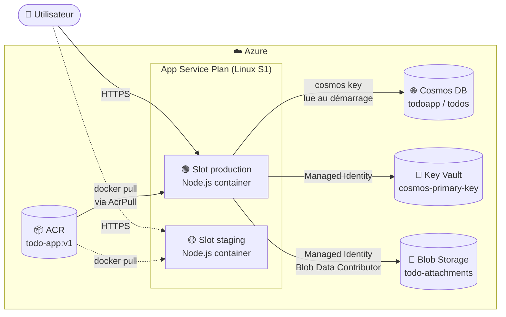

# Azure TODO App

Application web TODO conteneurisée, déployée sur Azure App Service for Containers dans le cadre du projet d'évaluation pratique Cloud Azure.

**URL de production** : https://webapp-todo-jval23.azurewebsites.net
**URL staging** : https://webapp-todo-jval23-staging.azurewebsites.net

---

## 1. Choix technologiques

| Couche           | Technologie                                          | Justification                                                                  |
| ---------------- | ---------------------------------------------------- | ------------------------------------------------------------------------------ |
| Runtime          | **Node.js 20**                                       | Stack légère, démarrage rapide du conteneur, écosystème Azure SDK très complet |
| Framework HTTP   | **Express**                                          | Standard minimaliste, parfait pour une API REST simple                         |
| Frontend         | **HTML + CSS + JS vanilla**                          | Pas de build step, servi en statique par Express, Dockerfile ultra simple      |
| Base de données  | **Azure Cosmos DB (API SQL)**                        | Requis par le sujet, schemaless, s'intègre bien au JSON natif de Node          |
| Secrets          | **Azure Key Vault** + **Managed Identity**           | Aucun secret dans le code ni dans les App Settings                             |
| Stockage objet   | **Azure Blob Storage**                               | Stockage des pièces jointes associées aux tâches                               |
| Conteneurisation | **Docker** (image multi-stage node:20-alpine)        | Image finale légère (~150 Mo), utilisateur non-root                            |
| Registry         | **Azure Container Registry (ACR)**                   | Requis par le sujet, intégration native avec App Service                       |
| Hébergement      | **Azure App Service for Containers** (plan Linux S1) | Nécessaire pour les deployment slots                                           |

---

## 2. Schéma d'architecture



**Flux au démarrage du conteneur** :

1. App Service tire l'image depuis ACR (droit `AcrPull` via Managed Identity).
2. L'app Node démarre et lit les App Settings (endpoints Cosmos/Storage, nom du Key Vault).
3. Via `DefaultAzureCredential` + Managed Identity, elle appelle Key Vault pour récupérer le secret `cosmos-primary-key`.
4. Elle initialise le client Cosmos DB avec cette clé, et le client Blob Storage avec la Managed Identity directement.
5. Express démarre, sert le frontend statique et expose `/api/todos`.

---

## 3. Ressources Azure utilisées

Toutes les ressources sont dans le même Resource Group `rg-todo-app` (région **Switzerland North**).

| Type               | Nom                                    | Rôle                                       |
| ------------------ | -------------------------------------- | ------------------------------------------ |
| Resource Group     | `rg-todo-app`                          | Conteneur logique de toutes les ressources |
| Container Registry | `acrtodoappjval23`                     | Héberge l'image Docker `todo-app:v1`       |
| Cosmos DB account  | `cosmos-todo-jval23`                   | Base NoSQL (API SQL)                       |
| ├─ database        | `todoapp`                              |                                            |
| └─ container       | `todos` (partition key `/id`)          |                                            |
| Storage Account    | `sttodoappjval23`                      | Stockage objet                             |
| └─ container       | `todo-attachments` (accès blob public) |                                            |
| Key Vault          | `kv-todo-jval23`                       | Stockage du secret `cosmos-primary-key`    |
| App Service Plan   | `plan-todo-app` (Linux S1)             | Compute mutualisé                          |
| Web App            | `webapp-todo-jval23`                   | Conteneur Node sur le slot production      |
| └─ slot            | `staging`                              | Environnement de pré-production            |

---

## 4. Principales commandes Azure CLI

Le script complet est dans `deploy-azure.sh`. Extraits commentés :

**Création des fondations**

```bash
az group create --name $RG --location switzerlandnorth

az acr create --name $ACR_NAME --resource-group $RG --sku Basic --admin-enabled true

# Build + push de l'image en local (Azure for Students ne permet pas `az acr build`)
az acr login --name $ACR_NAME
docker build -t ${ACR_NAME}.azurecr.io/todo-app:v1 .
docker push ${ACR_NAME}.azurecr.io/todo-app:v1
```

**Cosmos DB**

```bash
az cosmosdb create --name $COSMOS_NAME --resource-group $RG \
  --kind GlobalDocumentDB --locations regionName=$LOCATION

az cosmosdb sql database create --account-name $COSMOS_NAME \
  --resource-group $RG --name todoapp

az cosmosdb sql container create --account-name $COSMOS_NAME \
  --resource-group $RG --database-name todoapp \
  --name todos --partition-key-path "/id" --throughput 400
```

**Storage + Blob avec cycle de vie**

```bash
az storage account create --name $STORAGE_NAME --resource-group $RG \
  --sku Standard_LRS --kind StorageV2

az storage container create --name todo-attachments \
  --account-name $STORAGE_NAME --public-access blob --auth-mode login

az storage account management-policy create \
  --account-name $STORAGE_NAME --resource-group $RG --policy @lifecycle.json
```

**Key Vault + secret**

```bash
az keyvault create --name $KV_NAME --resource-group $RG \
  --enable-rbac-authorization true

az keyvault secret set --vault-name $KV_NAME \
  --name "cosmos-primary-key" --value "$COSMOS_KEY"
```

**App Service + Managed Identity**

```bash
az appservice plan create --name $PLAN_NAME --resource-group $RG \
  --is-linux --sku S1

az webapp create --name $WEBAPP_NAME --resource-group $RG --plan $PLAN_NAME \
  --deployment-container-image-name ${ACR_NAME}.azurecr.io/todo-app:v1

az webapp identity assign --name $WEBAPP_NAME --resource-group $RG

# Le principalId récupéré reçoit 3 rôles :
#   - Key Vault Secrets User   (lire le secret)
#   - Storage Blob Data Contributor   (écrire/lire les blobs)
#   - AcrPull                          (tirer l'image depuis ACR)
az role assignment create --role "Key Vault Secrets User" \
  --assignee-object-id $WEBAPP_PRINCIPAL_ID \
  --assignee-principal-type ServicePrincipal --scope $KV_ID

# Étape critique : activer l'utilisation de la Managed Identity
# pour que App Service puisse pull l'image depuis ACR
az webapp config set --name $WEBAPP_NAME --resource-group $RG \
  --generic-configurations '{"acrUseManagedIdentityCreds": true}'
```

**Deployment slot**

```bash
az webapp deployment slot create --name $WEBAPP_NAME --resource-group $RG \
  --slot staging --configuration-source $WEBAPP_NAME

# Pour swapper staging vers production :
az webapp deployment slot swap --name $WEBAPP_NAME --resource-group $RG \
  --slot staging --target-slot production
```

**Scaling manuel**

```bash
az appservice plan update --name $PLAN_NAME --resource-group $RG \
  --number-of-workers 2
```

---

## 5. Usage des services — explications

### Cosmos DB

Base NoSQL document qui stocke les tâches. Chaque tâche est un document JSON :

```json
{
  "id": "uuid",
  "title": "...",
  "done": false,
  "attachmentUrl": "...",
  "createdAt": "..."
}
```

La partition key est `/id` — simple et suffisante pour ce volume. L'app utilise le SDK `@azure/cosmos` avec la clé primaire récupérée depuis Key Vault. **À aucun moment la clé n'est stockée dans le code ou dans les App Settings de l'App Service.**

### Key Vault

Stocke le secret `cosmos-primary-key` (la clé primaire du compte Cosmos DB). L'App Service accède à Key Vault via sa Managed Identity système, qui dispose du rôle RBAC `Key Vault Secrets User`. Au démarrage, `src/config.js` utilise `DefaultAzureCredential` pour s'authentifier et lire le secret. Résultat : si quelqu'un accède aux App Settings, il ne voit que `KEY_VAULT_NAME` — aucune donnée sensible.

### Blob Storage

Stocke les pièces jointes associées aux tâches (upload via `POST /api/todos/:id/attachment`). Le container est en accès `blob` (anonyme en lecture), ce qui permet d'associer directement l'URL publique du fichier à la tâche. L'**écriture** se fait via la Managed Identity (rôle `Storage Blob Data Contributor`), donc aucune clé de stockage dans l'application. Une **règle de cycle de vie** supprime automatiquement les blobs après 30 jours.

### Deployment slots

Un slot `staging` a été créé en plus du slot `production`. Les deux slots partagent le même plan App Service mais sont des **environnements indépendants** (chacun avec sa propre URL, ses propres App Settings, sa propre Managed Identity). Intérêt :

- déployer une nouvelle version sur `staging`, la tester sans impact sur la production ;
- faire un **swap** (quasi-instantané) entre `staging` et `production` — ce qui évite un temps d'indisponibilité et permet un rollback immédiat si la nouvelle version pose problème.

### Scaling manuel

Le plan App Service a été passé manuellement de 1 à 2 instances (`--number-of-workers 2`). App Service répartit automatiquement les requêtes entre les instances, ce qui permet d'encaisser plus de charge sans changer de SKU. Utile pour absorber un pic prévisible (lancement, opération marketing, etc.). Après la démo, on revient à 1 instance pour limiter le coût.

---

## 6. Développement local

```bash
# 1. Installer les dépendances
npm install

# 2. Configurer les variables d'environnement
cp .env.example .env
# Éditer .env avec les valeurs réelles (endpoints + clés Cosmos et Storage)

# 3. Lancer l'application
npm start
# → http://localhost:3000
```

En local, l'app n'utilise pas Key Vault (la variable `KEY_VAULT_NAME` n'est pas définie dans `.env`), donc elle lit directement `COSMOS_KEY` et `STORAGE_CONNECTION_STRING` depuis le fichier `.env`. **Le même code** fonctionne en local et en production grâce à `DefaultAzureCredential` qui choisit automatiquement la bonne méthode d'authentification.

### Build Docker local

```bash
docker build -t todo-app:v1 .
docker run -p 3000:3000 --env-file .env todo-app:v1
```

---

## 7. Structure du projet

```
todo-app/
├── Dockerfile               # Image multi-stage node:20-alpine
├── .dockerignore
├── .env.example             # Template pour le dev local
├── package.json
├── server.js                # Point d'entrée Express
├── src/
│   ├── config.js            # Chargement config (Key Vault ou .env)
│   ├── cosmos.js            # Init client Cosmos DB
│   ├── blob.js              # Init client Blob Storage
│   └── routes/
│       └── todos.js         # API REST (GET/POST/PUT/DELETE + upload)
└── public/                  # Frontend statique
    ├── index.html
    ├── style.css
    └── app.js
```

---

## 8. Limites rencontrées et pistes d'amélioration

**Limites identifiées pendant le projet**

- **Azure for Students : ACR Tasks désactivé.** La commande `az acr build` (qui permet de builder une image directement dans Azure) est bloquée sur les souscriptions étudiantes. On a donc dû builder les images localement avec Docker Desktop puis les pousser avec `docker push`.
- **Azure for Students : Graph API limitée.** Les commandes `az ad signed-in-user show` et `az role assignment create --assignee <email>` déclenchent des appels à Microsoft Graph qui sont refusés ("Continuous access evaluation challenge"). On a contourné le problème en extrayant l'Object ID directement depuis le token JWT (`az account get-access-token`) et en utilisant `--assignee-object-id` + `--assignee-principal-type` explicitement.
- **Key Vault soft-delete** : une première tentative de création de Key Vault a échoué puis été supprimée, ce qui l'a mis en état "soft-deleted" pendant 90 jours. Il faut faire `az keyvault purge` avant de pouvoir recréer un vault du même nom. Ce comportement est activé par défaut depuis 2021 et il n'est pas désactivable.
- **Option `acrUseManagedIdentityCreds` obligatoire** : sans cette option, l'App Service essaie d'utiliser les credentials admin ACR pour pull l'image (et échoue), même si la Managed Identity a bien le rôle `AcrPull`. Cette subtilité n'est pas évidente dans la documentation de base.
- **SKU S1 obligatoire** : les deployment slots ne sont pas disponibles sur les tiers Free/Basic, ce qui impose un coût non négligeable (~2$/jour) pour un projet de démonstration. Il faut supprimer le Resource Group après la démo.
- **Accès blob public** : le container Blob est en accès `blob` (anonyme en lecture) pour simplifier l'affichage des pièces jointes. En production réelle, il faudrait plutôt générer des **SAS tokens** à durée limitée pour chaque fichier afin de ne pas exposer les URLs indéfiniment.
- **Clé Cosmos plutôt que AAD** : pour rester dans l'esprit du sujet (« stocker un secret dans Key Vault »), on utilise la clé primaire Cosmos. Une approche plus moderne serait d'utiliser **l'authentification AAD de Cosmos DB** directement via Managed Identity, ce qui supprimerait totalement le besoin de secret.
- **Pas de pipeline CI/CD** : le déploiement se fait manuellement. Un pipeline GitHub Actions ou Azure DevOps serait la suite logique pour automatiser le build/push/swap.
- **Pas d'authentification utilisateur** : tout le monde peut lire/écrire les tâches. Dans une vraie app, on ajouterait Azure AD B2C ou Easy Auth (fourni nativement par App Service).
